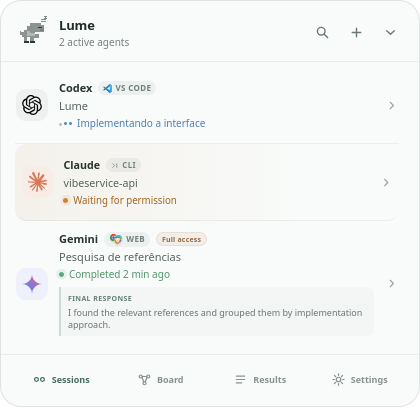
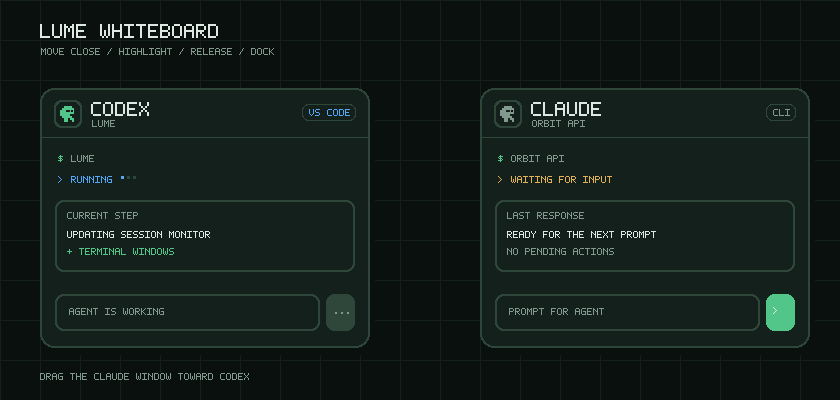
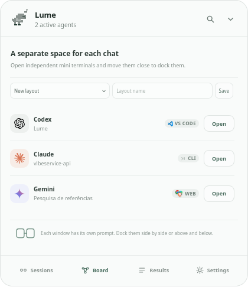
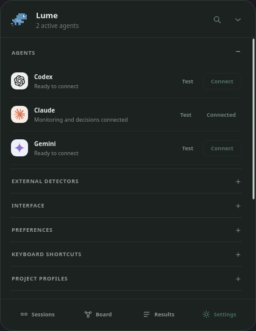

<p align="center">
  
</p>

<h1 align="center">Lume</h1>

<p align="center">
  A quiet, local hub for every AI coding agent running on your computer.
</p>

<p align="center">
  <a href="https://github.com/tulerws/Lume/releases/latest"><strong>Download the latest release</strong></a>
  · Windows · Linux · Android
</p>

<p align="center">
  
</p>

## What Lume does

Lume stays as a small capsule at the top of the screen and watches Codex, Claude, and Gemini sessions opened from a CLI, VS Code, or a supported browser. It shows which agent is working, waiting, finished, failed, or requesting permission without forcing you to keep every terminal visible.

Expand the capsule to review all sessions, approve supported actions, continue a chat, inspect final responses, and open independent Whiteboard windows for focused work.

## How it works

1. **Install Lume** and connect the agent integrations you use.
2. **Keep working normally.** Lume discovers supported sessions already running on the machine.
3. **Follow the capsule.** Its mascot, color, counter, sound, and notifications reflect what needs attention.
4. **Open the hub when needed.** Send a prompt to one specific agent, review its response and changed files, or manage the same sessions from Lume Mobile.

Desktop data stays on the computer. Mobile access is disabled by default and, when enabled, uses a paired and encrypted connection over the local network.

## Screenshots

<p align="center">
  
</p>

<p align="center">
  <sub>Move a terminal close to another one, follow the docking highlight, and release to join both windows.</sub>
</p>

<table>
  <tr>
    <td align="center">
      <br />
      <sub><strong>Whiteboard</strong> — open, arrange, resize, and dock independent agent windows.</sub>
    </td>
    <td align="center">
      <br />
      <sub><strong>Settings</strong> — connect agents and keep advanced options organized.</sub>
    </td>
  </tr>
</table>

## Highlights

- Real-time monitoring for Codex, Claude, and Gemini across CLI, VS Code, and supported Chromium browsers.
- Clear permission requests with approve or deny actions when the source integration supports them.
- Continuous per-session chat with Markdown, images, observable commands, final responses, and changed files.
- Floating Whiteboard windows with resize, horizontal or vertical docking, grouped movement, and saved layouts.
- TO DO, GOAL, elapsed-time, and rate-limit indicators for supported agents.
- One-QR mobile pairing through the Android app or browser interface, with per-device permissions.
- Session launcher, command palette, global shortcuts, tray access, optional sounds, and automatic updates.
- Local-first storage with sanitized history and explicitly saved result notes.

## Supported sources

| Source | Detection | Direct permission actions |
| --- | --- | --- |
| Claude CLI | Processes and hooks | Yes |
| External Codex CLI/VS Code sessions | Processes, rollouts, and hooks | Monitoring only |
| Codex sessions opened by Lume | Local App Server | Yes |
| Gemini CLI | Processes and hooks | Monitoring only |
| ChatGPT, Claude, and Gemini web | Chromium Companion | Opens the matching tab |

Lume only displays actions supported by the current session. It never simulates an approval that the source integration cannot perform. The session hub shows only observable information exposed by the agent, App Server, or hooks. Private model reasoning is never available.

## Install

The [latest GitHub release](https://github.com/tulerws/Lume/releases/latest) provides:

- Windows NSIS installer (`.exe`)
- Debian/Ubuntu package (`.deb`)
- Fedora/RHEL package (`.rpm`)
- Portable Linux AppImage
- Android application (`Lume-Mobile.apk`)

Lume checks for updates automatically and lets you install them from **Settings → About**. Each GitHub release includes curated patch notes describing user-visible improvements and fixes.
Lume Mobile checks the signed Android release automatically and verifies its SHA-256 hash before opening the system installer. The PWA refreshes its cached application files automatically. iOS updates remain managed by TestFlight or the App Store.

To connect a phone, enable **Settings → Mobile access** and scan the QR code. If the Android app is installed it opens with the pairing details; otherwise the hosted PWA opens and offers the APK download. The browser may ask for local-network access, but no certificate installation is required.

## Run in development

Requirements: Node.js 22+, stable Rust, and the Tauri system dependencies.

On Pop!_OS or Ubuntu:

```bash
sudo apt-get update
sudo apt-get install -y libwebkit2gtk-4.1-dev libgtk-3-dev libgtk-layer-shell0 build-essential curl wget file libssl-dev libayatana-appindicator3-dev librsvg2-dev libdbus-1-dev pkg-config
```

Then run:

```bash
npm install
npm run check
npm run tauri dev
```

Lume opens on the primary monitor and adds an icon to the system tray. Use **Settings** to connect installed agents, configure VS Code, install the browser Companion, and customize shortcuts.

## Connect agent sources

After connecting Codex for the first time, run `/hooks` inside Codex and trust the **Lume** hook. Codex requires this confirmation for new or modified local hooks.

To install the browser Companion:

1. Open **Settings → Browsers → Open folder** in Lume.
2. Visit `chrome://extensions` or the equivalent page in Edge or Brave.
3. Enable developer mode.
4. Load the Companion folder as an unpacked extension.

The Companion sends only the agent type, state, sanitized title, source, and a local hash of the path. Prompts submitted through Lume travel only over the local connection to the selected tab and are not stored in Lume history.

## Linux display support

On compatible Wayland compositors, Lume uses Layer Shell for monitor-aware placement. The `.deb` package installs `libgtk-layer-shell0`; AppImage users should install that package separately when native Layer Shell behavior is desired.

Fedora Workstation with GNOME Wayland automatically uses the XWayland fallback because GNOME does not expose Layer Shell. This keeps dragging and saved overlay positions functional. Set `LUME_FORCE_NATIVE_WAYLAND=1` to test the native backend explicitly.

Global shortcuts are registered directly on Windows and integrated with the desktop shortcut systems used by COSMIC and GNOME.

## Keyboard shortcuts

Default shortcuts:

| Action | Shortcut |
| --- | --- |
| Open Lume | `Ctrl+Alt+Shift+L` |
| Open command palette | `Ctrl+Shift+Space` |
| Start a new session | `Ctrl+Alt+Shift+N` |
| Open the Whiteboard | `Ctrl+Alt+Shift+B` |

All shortcuts can be changed from **Settings → Keyboard shortcuts**. `Ctrl+Shift+P` also opens the command palette while the Lume window is focused.

## Build installers

```bash
npm run tauri build
```

Linux bundles are written to `src-tauri/target/release/bundle`. The **Installers** GitHub Actions workflow builds `.deb`, `.rpm`, AppImage, and Windows NSIS packages, creates the GitHub Release, signs updater artifacts, and publishes the `latest.json` manifest.

Before publishing a release, configure `TAURI_SIGNING_PRIVATE_KEY` in **Settings → Secrets and variables → Actions**. The public key belongs in the application configuration; the private key must never be committed. Update the version in `package.json`, `package-lock.json`, `src-tauri/Cargo.toml`, `src-tauri/Cargo.lock`, and `src-tauri/tauri.conf.json`, then push a `v*` tag. Add curated patch notes to the GitHub Release description after the workflow creates it.

Android releases also require `ANDROID_KEYSTORE_BASE64`, `ANDROID_KEYSTORE_PASSWORD`, `ANDROID_KEY_ALIAS`, and `ANDROID_KEY_PASSWORD` as GitHub Actions secrets. Keep a secure backup of that keystore: Android only accepts automatic updates signed by the same certificate as the installed application.

## External detectors

Use **Settings → External detectors** to install a JSON manifest for another CLI. See [`docs/external-plugin.example.json`](docs/external-plugin.example.json) for the format.

Manifests only declare process names and matching tokens. They do not load libraries or execute commands inside Lume. Detector changes take effect on the next scan without restarting the application.

## Privacy

Everything stays on the machine. Desktop integrations listen only on localhost. The mobile gateway opens port `43124` on the local network only after the user enables it, accepts only paired devices, and encrypts API payloads with keys established through the one-time QR code. The public PWA contains only static application files; prompts, responses, permissions, and tokens are never sent to it.

Session messages and final responses remain in memory. SQLite stores preferences, sanitized history summaries, and only the responses the user explicitly chooses to save as notes.

Read more in [Product](docs/PRODUCT.md) and [Privacy](docs/PRIVACY.md).
