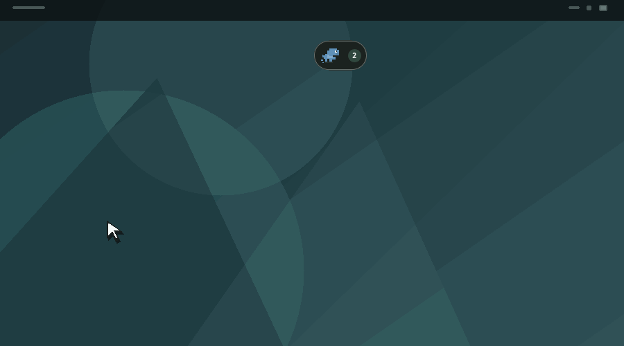

<p align="center">
  
</p>

<h1 align="center">Lume</h1>

<p align="center">
  A local-first command center for every AI coding agent running on your computer.
</p>

<p align="center">
  <a href="https://github.com/tulerws/Lume/releases/latest"><strong>Download the latest release</strong></a>
  · Windows · Linux · Android
</p>

## What it does

Lume stays as a small capsule at the top of the screen and keeps track of every agent session opened from a CLI, VS Code, or a supported browser. It shows which agent is working, waiting, finished, failed, or requesting permission without forcing you to keep every terminal visible.

Expand the capsule to review all sessions, approve supported actions, continue a chat, inspect final responses, and open independent terminal windows for focused work. Opt in to Workflow mode when several agents should work as a coordinated sequence.

Lume does not require an account or upload your workspace to a Lume-hosted service. Prompts still follow the connection of the agent you choose, so the privacy policy of that AI provider continues to apply.

<p align="center">
  
</p>

<table>
  <tr>
    <td align="center">
      <br />
      <sub><strong>Organize your workspace</strong> — open a terminal for one agent or restore a saved layout.</sub>
    </td>
    <td align="center">
      <br />
      <sub><strong>Connect once</strong> — integrations and advanced preferences stay organized and out of the way.</sub>
    </td>
  </tr>
</table>

## How it works

1. **Install Lume** and connect the agent integrations you use.
2. **Keep working normally.** Lume discovers supported sessions already running on the machine.
3. **Follow the capsule.** Its mascot, color, counter, sound, and notifications reflect what needs attention.
4. **Open the hub when needed.** Send a prompt to one specific agent, review its response and changed files, or manage the same sessions from Lume Mobile.

Desktop data stays on the computer. Mobile access is disabled by default and, when enabled, uses a paired and encrypted connection over the local network.

## Multi-agent workflows

Dock terminals, switch the group from **Normal** to **Workflow**, and assign a role to each step: Planner, Implementer, Reviewer, Tester, Researcher, or a custom contract. Normal mode remains a visual workspace; no context is shared until Workflow mode is explicitly enabled.

Each connection controls its direction, context policy, approval requirement, and manual or automatic handoff behavior. Lume builds a sanitized context package from the source result instead of copying the full conversation or private model reasoning.

Workflow runs are stored locally and can recover after Lume restarts. The consolidated history keeps each step, handoff, approval, result, changed-file summary, and validation together. Paired mobile devices provide a read-only view of each agent's role and current state; workflow control remains on the desktop. Guardrails limit transitions, retries, step duration, sensitive handoffs, and low rate-limit situations.

## Floating terminals

Turn any monitored session into a focused floating chat. Each terminal keeps the agent conversation, live activity, changed files, TO DO and GOAL progress, rate limits, image attachments, and prompt input together in one window.

<p align="center">
  
</p>

Move terminals freely, resize them from the corners, or dock them horizontally or vertically. Docked terminals form a group and move together while remaining independent chats.

## Highlights

- Real-time monitoring for Codex, Claude Code, Antigravity CLI, DeepSeek Harness, legacy Gemini CLI, and supported web agents through their available CLI, VS Code, and Chromium integrations.
- Clear permission requests with approve or deny actions when the source integration supports them; automatic approval profiles continue without false attention alerts.
- Continuous per-session chat with Markdown, images, observable commands, final responses, and changed files.
- Floating terminal windows with resize, horizontal or vertical docking, grouped movement, and saved layouts.
- Opt-in multi-agent workflows with roles, safe context handoffs, approval gates, persistence, recovery, and loop protection.
- Persistent session Notes for long-running plans and reusable context without mixing them into the current TO DO.
- TO DO, GOAL, elapsed-time, and rate-limit indicators for supported agents.
- One-QR mobile pairing through the Android app or browser interface, with per-device permissions.
- Session launcher, command palette, global shortcuts, tray access, optional sounds, and automatic updates.
- External Codex and Claude Code CLIs stay untouched and are monitored read-only until you explicitly transfer that thread to Lume.
- Per-thread model and reasoning-effort selection for Lume-controlled Codex and Claude Code sessions.
- Local-first storage with sanitized history and explicitly saved result notes.

## Supported sources

| Source | Detection | Direct permission actions |
| --- | --- | --- |
| External Claude Code CLI | Processes and hooks | Monitoring; explicit transfer resumes the same conversation through Lume |
| External Codex CLI and VS Code | Processes, rollouts, and hooks | Monitoring; explicit transfer resumes the same thread through Lume |
| Codex sessions controlled by Lume | Local App Server | Prompts, queue, steer, approvals, model, and reasoning effort |
| Claude Code sessions controlled by Lume | Official Claude CLI and hooks | Prompts, supported permission actions, model, and reasoning effort |
| Antigravity CLI | `agy` processes and native hooks | Live task monitoring; direct permission actions are not exposed yet |
| DeepSeek Harness | Official `dsh` process | Opens the configured TUI profile; process monitoring |
| Gemini CLI (legacy enterprise/API use) | Processes and legacy hooks | Monitoring only |
| ChatGPT, Claude, DeepSeek, and Gemini web | Chromium Companion | Local prompts, status, final response, and opening the matching tab |

Lume only displays actions supported by the current session. It never simulates an approval that the source integration cannot perform. The session hub shows only observable information exposed by the agent, App Server, or hooks. Private model reasoning is never available.

Google is transitioning individual Gemini CLI users to Antigravity CLI. Lume therefore treats Antigravity as a separate agent instead of renaming Gemini: `agy` uses its own lifecycle events and the shared `~/.gemini/config/hooks.json` registry, while the legacy Gemini integration remains available for enterprise, Google Cloud, and API-key workflows. Connecting Antigravity adds or removes only the named `lume` entry and preserves other hooks.

Process detection works independently of hooks. Antigravity hook delivery on Windows and WSL still has open upstream reliability reports, so those environments may show the `agy` session before live tool events begin arriving.

## Install

The [latest GitHub release](https://github.com/tulerws/Lume/releases/latest) provides:

- Windows NSIS installer (`.exe`)
- Debian/Ubuntu package (`.deb`)
- Fedora/RHEL package (`.rpm`)
- Portable Linux AppImage
- Android application (`Lume-Mobile.apk`)

Lume checks for updates automatically and lets you install them from **Settings → About**. Each GitHub release includes curated patch notes describing user-visible improvements and fixes.

If an older development build installed the retired Codex CLI Gateway, the first start removes only Lume's marked shell `PATH` blocks and wrapper files. Open a new terminal afterward (or refresh the shell command cache) so `codex` resolves directly to the official CLI again.
Lume Mobile checks the signed Android release automatically and verifies its SHA-256 hash before opening the system installer. The PWA refreshes its cached application files automatically. iOS updates remain managed by TestFlight or the App Store.

To connect a phone, enable **Settings → Mobile access** and scan the QR code. If the Android app is installed it opens with the pairing details; otherwise the hosted PWA opens and offers the APK download. The browser may ask for local-network access, but no certificate installation is required.

## Run in development

Requirements: Node.js 22+, stable Rust, and the Tauri system dependencies.

On Pop!_OS or Ubuntu:

```bash
sudo apt-get update
sudo apt-get install -y libwebkit2gtk-4.1-dev libgtk-3-dev libgtk-layer-shell0 build-essential curl wget file libssl-dev libayatana-appindicator3-dev librsvg2-dev libdbus-1-dev pkg-config
```

Then run:

```bash
npm install
npm run check
npm run tauri dev
```

Lume opens on the primary monitor and adds an icon to the system tray. Use **Settings** to connect installed agents, configure VS Code, install the browser Companion, and customize shortcuts.

The standalone marketing site is isolated from the desktop UI. Build or preview it with:

```bash
npm run landing:build
npm run landing:dev
```

## Connect agent sources

After connecting Codex for the first time, run `/hooks` inside Codex and trust the **Lume** hook. Codex requires this confirmation for new or modified local hooks.

To install the browser Companion:

1. Open **Settings → Browsers → Open folder** in Lume.
2. Visit `chrome://extensions` or the equivalent page in Edge or Brave.
3. Enable developer mode.
4. Load the Companion folder as an unpacked extension.

The Companion distinguishes ChatGPT, Claude, DeepSeek, and Gemini. It sends the agent type, state, sanitized title, source, a local tab identifier, and the final response displayed by the selected chat. Prompts submitted through Lume travel only over the local connection to the selected tab, and conversation content is not persisted in Lume history.

## Linux display support

On compatible Wayland compositors, Lume uses Layer Shell for monitor-aware placement. The `.deb` package installs `libgtk-layer-shell0`; AppImage users should install that package separately when native Layer Shell behavior is desired.

Fedora Workstation with GNOME Wayland automatically uses the XWayland fallback because GNOME does not expose Layer Shell. This keeps dragging and saved overlay positions functional. Set `LUME_FORCE_NATIVE_WAYLAND=1` to test the native backend explicitly.

Global shortcuts are registered directly on Windows and integrated with the desktop shortcut systems used by COSMIC and GNOME.

## Keyboard shortcuts

Default shortcuts:

| Action | Shortcut |
| --- | --- |
| Open Lume | `Ctrl+Alt+Shift+L` |
| Open command palette | `Ctrl+Shift+Space` |
| Start a new session | `Ctrl+Alt+Shift+N` |
| Open the Whiteboard | `Ctrl+Alt+Shift+B` |

All shortcuts can be changed from **Settings → Keyboard shortcuts**. `Ctrl+Shift+P` also opens the command palette while the Lume window is focused.

## Build installers

```bash
npm run tauri build
```

Linux bundles are written to `src-tauri/target/release/bundle`. The **Installers** GitHub Actions workflow builds `.deb`, `.rpm`, AppImage, and Windows NSIS packages, creates the GitHub Release, signs updater artifacts, and publishes the `latest.json` manifest.

Before publishing a release, configure `TAURI_SIGNING_PRIVATE_KEY` in **Settings → Secrets and variables → Actions**. The public key belongs in the application configuration; the private key must never be committed. Update the version in `package.json`, `package-lock.json`, `src-tauri/Cargo.toml`, `src-tauri/Cargo.lock`, and `src-tauri/tauri.conf.json`, then push a `v*` tag. Add curated patch notes to the GitHub Release description after the workflow creates it.

Android releases also require `ANDROID_KEYSTORE_BASE64`, `ANDROID_KEYSTORE_PASSWORD`, `ANDROID_KEY_ALIAS`, and `ANDROID_KEY_PASSWORD` as GitHub Actions secrets. Keep a secure backup of that keystore: Android only accepts automatic updates signed by the same certificate as the installed application.

## External detectors

Use **Settings → External detectors** to install a JSON manifest for another CLI. See [`docs/external-plugin.example.json`](docs/external-plugin.example.json) for the format.

Manifests only declare process names and matching tokens. They do not load libraries or execute commands inside Lume. Detector changes take effect on the next scan without restarting the application.

## Privacy

Everything stays on the machine. Desktop integrations listen only on localhost. The mobile gateway opens port `43124` on the local network only after the user enables it, accepts only paired devices, and encrypts API payloads with keys established through the one-time QR code. The public PWA contains only static application files; prompts, responses, permissions, and tokens are never sent to it.

Live session messages are not copied into a separate Lume transcript database. SQLite stores preferences, workflow definitions and recovery state, persistent plans and notes, sanitized activity history, explicitly saved results, and the bounded final-result summaries needed by the consolidated workflow history.

Read more in [Product](docs/PRODUCT.md) and [Privacy](docs/PRIVACY.md).
